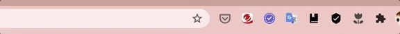

# 01_Hello
Google extension アイコンをクリックすると自作HTMLを表示させます。

## 本プロジェクトの動かし方
### インストール
Chromeの拡張機能を開いてデベロッパーモードをONにします。  
  
***
パッケージ化されていない拡張機能を読み込みをクリックして、「01_Hello」フォルダ（このフォルダ）を読み込みます。  
  
***
拡張機能を選択します。  
  
***
「01_Hello」がGoogle extension アイコンに表示されるようピン留めします。  
  
***
Google extension アイコンに一覧にチューリップのアイコンが表示されればOKです。  
  
***

## 本プロジェクトの概要
### ファイル構成
```manifest.json``` は設定ファイルとなります。  
```popup.html```はGoogle extension アイコンをクリックしたときに表示されるHTMLになります。  
このプロジェクトでは得にJS, CSSは使用していません。  
### 挙動
iconをクリックしたときに```popup.html```が動作します。
```json
"browser_action": {
    "default_icon": {
        "16": "icon.png"
    },
    "default_popup": "popup.html"
}
```
