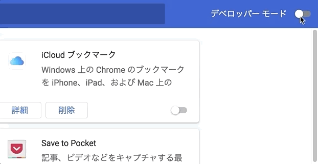
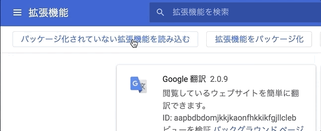
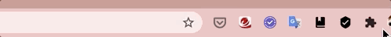

# 01_Hello
Google extension アイコンをクリックすると自作HTMLを表示させます。

## 本プロジェクトの動かし方
### インストール
Chromeの拡張機能を開いてデベロッパーモードをONにします。

パッケージ化されていない拡張機能を読み込みをクリックして、「01_Hello」を読み込みます。

拡張機能を選択します。

「01_Hello」がGoogle extension アイコンに表示されるようピン留めします。

