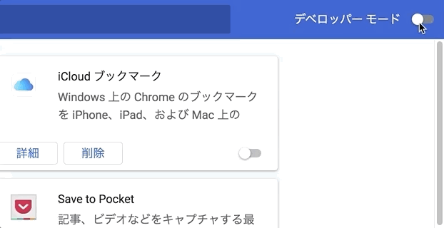
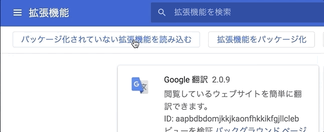
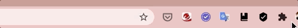
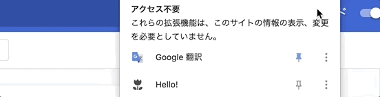
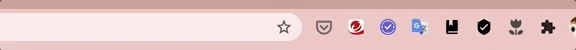

# learning-google-extension
Google extension を作成するための基本的な勉強したのでそのまとめまです。

## What I learn in this project.  
Google Extensionの基本的なことを学びました。
* アイコンの表示方法  
* アイコンリクック時にHTMLを表示する方法  
* Chromeのタブ情報をGoogle ExtensionのHTMLへ表示させる方法
* Google ExtensionのHTMLの情報をChromeで開いているWebページへ反映させる方法
* Google Extensionのオプション値をGoogle Extensionへ保存する方法  
* Google Extensionのオプション値をChromeで開いているWebページへ反映させる方法
* 画面右クリックで発動するGoogle Extensionの作り方
* ページ初期表示にJavaScriptを実行する方法
* Google Extensionのアイコン上に任意の値を表示する方法
* タブ初期表示時にHTMLを表示させる方法

## Project Structure  
このプロジェクトでは、以下のフォルダ毎にそれぞれのGoogle Extensionを用意しています。  

| ディレクトリ                               | 概要           | 学んだこと                     |
| ---------------------------------------- | ------------ | ------------------------- |
| [01_Hello](./01_Hello)                   | HTMLを表示    | Chromeへのアイコン表示            |
|                                          |              | アイコンクリックでHTML表示           |
| [02_ShowTabsInfo](./02_ShowTabsInfo)     | タブ名を取得   | タブ名の取得                    |
|                                          |              | 取得したタブ名をHTMLで表示           |
| [03_ChangeBgColor](./03_ChangeBgColor)   | 背景色変更     | HTMLでリスト表示                |
|                                          |              | 表示されているWebページの背景色変更       |
| [04_OptionsUi](./04_OptionsUi)           | Chromeストレージ  | Chromeのオプションを開く           |
|                                          |                  | Chromeストレージへ保存            |
|                                          |                  | Chromeストレージ読み込み           |
| [05_ContextMenus](./05_ContextMenus)     | 右クリック        | 右クリックでメニュー表示              |
|                                          |                  | メニュー内容を取得                 |
| [06_ContextScript](./06_ContextScript)   | リンク数取得       | 表示されているWebページのリンク数を取得     |
| [07-MessagePassing](./07-MessagePassing) | アイコンへ数字を反映   | リンク数を取得してChromeアイコンへ数字を反映 |
| [08-NewTab](./08-NewTab)                 | 初期表示時にHTML表示 | Chromeタブを初期表示時に自前のHTMLを表示 |

1. [01_Hello](./01_Hello)  
Google Extension アイコンを表示してクリックした時に「Hello」と表示します。  
2. [02_ShowTabsInfo](./02_ShowTabsInfo)  
Chromeのタブ情報を読み込みこんで、タブ名をGoolge ExtensionのHTMLへ表示します。  
3. [03_ChangeBgColor](./03_ChangeBgColor)  
Goolge ExtensionのHTMLセレクトボックスで色を選択して、Chromeで開いているWebページの背景色へその色を反映させます。  
4. [04_OptionsUi](./04_OptionsUi)  
Goolge Extensionのオプションで色を選択して、Chromeで開いているWebページの背景色へその色を反映させます。  
5. [05_ContextMenus](./05_ContextMenus)  
Chromeで開いているWebページを右クリックして色を選択して、Chromeで開いているWebページの背景色へその色を反映させます。  
6. [06_ContextScript](./06_ContextScript)  
Webページの初期表示にJavaScriptを実行して、リンク数をアラートで表示させます。  
7. [07-MessagePassing](./07-MessagePassing)  
Chromeで開いているWebページのリンク数をGoogle Extensionのアイコン上に表示させます。  
8. [08-NewTab](./08-NewTab)  
Chromeのタブを初期表示時に自前のHTMLを表示させます。  

## Get started
このプロジェクトで用意されたGoogle ExtensionをChromeで動かす方法を説明します。

### Prerequisites
Chromeのみあれば動かすことができます。  

### Installing
[01_Hello](./01_Hello)のフォルダを例にしてインストール方法を記述します。  
他フォルダでも同様の方法でGoogle Extensionをインストールすることができます。  

#### デベロッパーモードをONにする
Chromeの拡張機能を開いてデベロッパーモードをONにします。  
  
***
#### Google Extensionを読み込む
パッケージ化されていない拡張機能を読み込みをクリックして、各プロジェクト（例えば「01_Hello」フォルダ）を読み込みます。  
  
***
#### Google Extensionを有効にする
拡張機能を選択します。  
  
***
「01_Hello」がGoogle extension アイコンに表示されるようピン留めします。  
  
***

### Running the test
Google extension アイコンに一覧に表示されたチューリップのアイコンをクリックすると動作します。  
  
***

## Acknowledgments
[Google Extensionの公式ページ](https://developer.chrome.com/extensions)
